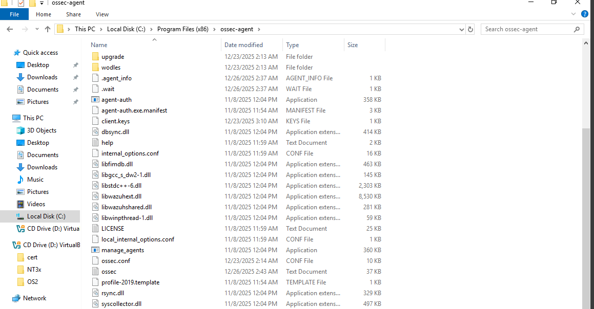
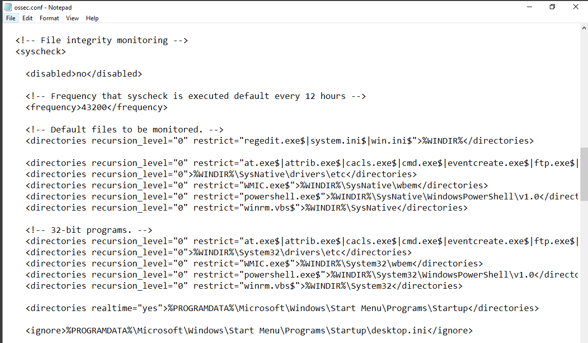
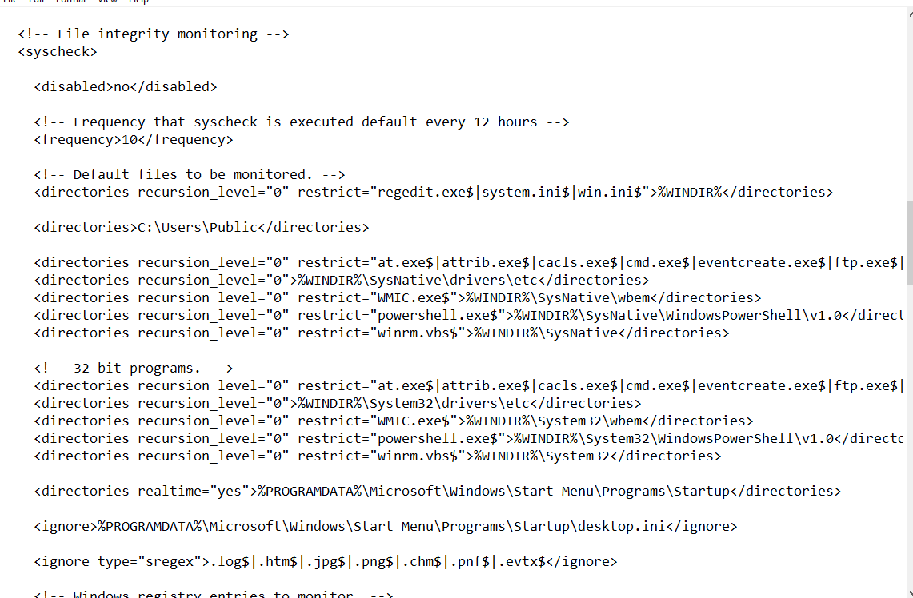
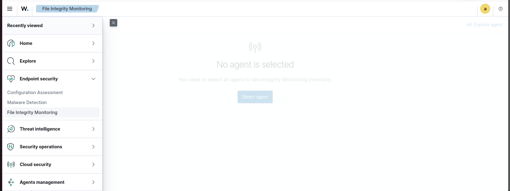
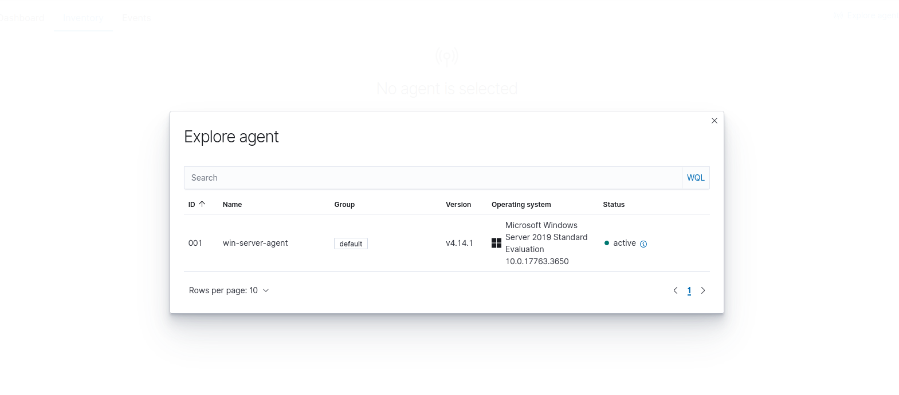
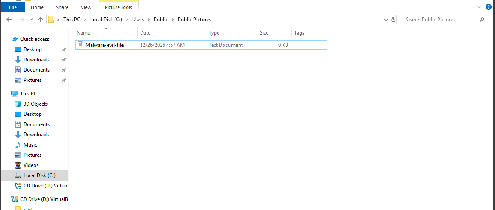
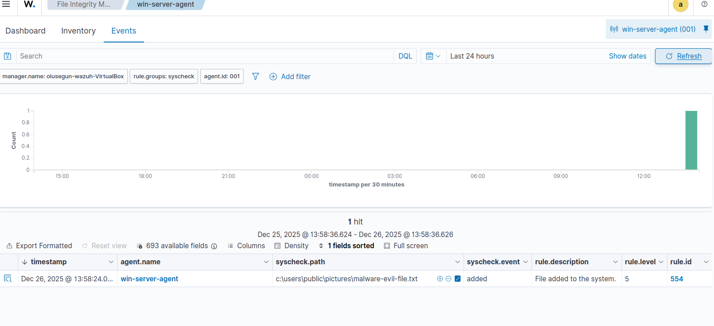
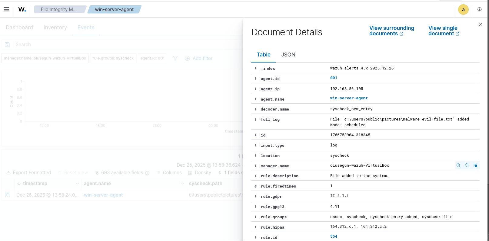
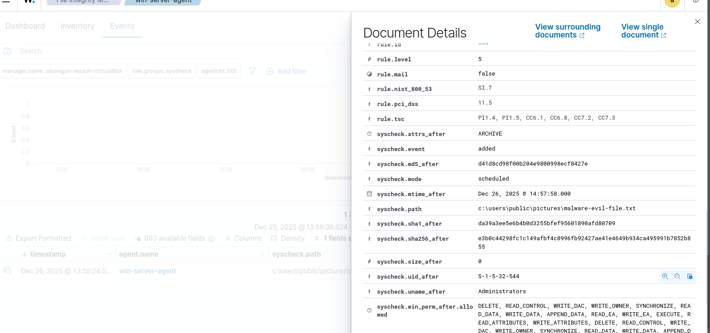

# File Integrity Monitoring (FIM) on Windows Server using Wazuh

## Overview
File Integrity Monitoring (FIM) is a security capability used to detect **unauthorized changes to critical files and directories**. Attackers often modify system files, configuration files, or sensitive directories to maintain persistence, escalate privileges, or evade detection.

This project demonstrates how to **configure and monitor File Integrity Monitoring on a Windows Server using Wazuh**, analyze alerts in the Wazuh dashboard, and perform SOC-style investigation and documentation.

---

## Objectives
- Configure File Integrity Monitoring on a Windows Server
- Detect file creation, modification, deletion, and permission changes
- Monitor and analyze FIM alerts in Wazuh
- Correlate Wazuh alerts with Windows Security Event Logs
- Map detected activities to the MITRE ATT&CK framework
- Practice real-world SOC alert triage

---

## Lab Architecture

- **Wazuh Manager:** Ubuntu Server
- **Wazuh Dashboard:** Web UI
- **Wazuh Agent:** Windows Server

```

[Windows Server + Wazuh Agent] → [Wazuh Manager] → [Wazuh Dashboard]

```

---

## Tools & Technologies
- Wazuh SIEM
- Windows Server
- Windows Security Event Logs
- PowerShell
- MITRE ATT&CK Framework

---

## Why File Integrity Monitoring Matters
File integrity monitoring helps detect:
- Unauthorized configuration changes
- Persistence mechanisms
- Tampering with system or application files
- Insider threats
- Malware attempting to hide or modify artifacts

FIM is commonly used in **enterprise SOCs, regulated environments, and compliance-driven organizations**.

---

## Monitored Directories (Example)
The following directories were selected due to their security relevance:

- `C:\Windows\System32`
- `C:\Program Files`
- `C:\SensitiveData` (custom test directory)

These locations often contain files targeted during post-exploitation and persistence activities.

---

## Step 1: Configure File Integrity Monitoring on Windows Server

On the Windows Server, edit the Wazuh agent configuration file:

```

C:\Program Files (x86)\ossec-agent\ossec.conf

````



Add or update the FIM configuration:


```
To add:
Add the folder/directory you want the windows agent to monitor

Note:
At the very top of the file monitoring is the time interval, this determins the interval at which the files will be monitored, it can be changed to your desired time interval.

````

```xml
<syscheck>
  <disabled>no</disabled>
  <frequency>3600</frequency>

  <directories check_all="yes">C:\Windows\System32</directories>
  <directories check_all="yes">C:\Program Files</directories>
  <directories check_all="yes">C:\SensitiveData</directories>
</syscheck>
````

Restart the Wazuh agent service:

```powershell
Restart-Service WazuhSvc
```



---

## Step 2: (Optional) Enable Windows Object Access Auditing

To enrich investigations, enable file auditing in Windows:

1. Open `secpol.msc`
2. Navigate to:

```
Advanced Audit Policy Configuration →
Object Access →
Audit File System
```

3. Enable **Success** and **Failure**

This allows correlation with **Windows Security Event ID 4663**.

---

## Step 3: Select Wazuh agent for File Monitoring

1. Log into the **Wazuh Dashboard**
2. Go to Endpoint Security and select **File Integrity Monitoring**



3. In the Inventory Section, select agent and add your window-server




## Step 4: Generate File Integrity Events

Create and modify files to simulate activity:

```powershell
New-Item C:\SensitiveData\testfile.txt
Add-Content C:\SensitiveData\testfile.txt "Test modification"
Remove-Item C:\SensitiveData\testfile.txt
```

These actions simulate:

* File creation
* File modification
* File deletion

---


## Step 4: Monitor FIM Alerts in Wazuh Dashboard

1. Log into the **Wazuh Dashboard**
2. Navigate to **Security Events**
3. Filter by:

```
agent.name: windows-server
```

Observe alerts related to:

* File added
* File modified
* File deleted
* Permission changes

---






## Step 5: SOC-Style Alert Analysis

For each alert, analyze:

* File path affected
* Type of change
* Timestamp
* User account responsible
* Whether the activity is authorized

---

## Windows Event IDs Used for Correlation

| Event ID | Description                   |
| -------- | ----------------------------- |
| 4663     | File or object access         |
| 4656     | Handle requested to an object |
| 4660     | Object deleted                |
| 4670     | Permissions changed           |
| 4719     | Audit policy changed          |

---

## MITRE ATT&CK Mapping

| Activity                       | Technique |
| ------------------------------ | --------- |
| Unauthorized file modification | T1565     |
| Persistence via file changes   | T1547     |
| Defense evasion                | T1070     |

---

## Sample SOC Incident Summary

**Alert:** Unauthorized file modification
**Source:** Wazuh FIM
**Severity:** Medium
**Evidence:** Wazuh alert + Windows Event ID 4663
**Assessment:** Suspicious activity
**Action:** Investigate and validate change

---

## Key Learning Outcomes

* Implemented File Integrity Monitoring on Windows Server
* Detected and analyzed file system changes
* Correlated Wazuh alerts with Windows Security logs
* Applied MITRE ATT&CK mapping
* Practiced SOC alert triage and documentation

---

## Real-World SOC Relevance

This project reflects real-world SOC responsibilities such as:

* Monitoring system integrity
* Investigating unauthorized changes
* Detecting persistence techniques
* Supporting compliance and audit requirements

---

## Author

**Olusegun Fajobi**
Cybersecurity | SOC Analyst | SIEM
GitHub: [https://github.com/samfajobi](https://github.com/samfajobi)

---

